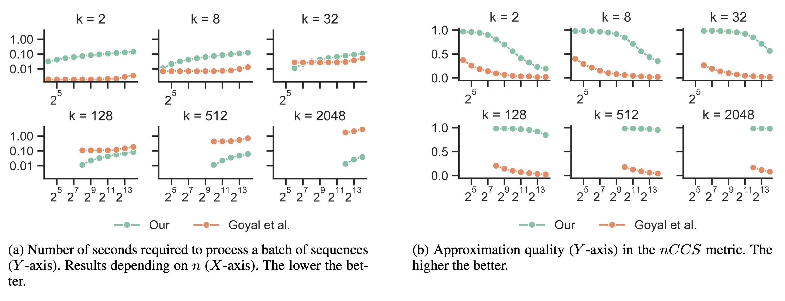

# Successive Halving Top-k Operator 
This repository contains a demonstrative implementation of Successive Halving Top-k Operator, 
complementing the [Applica.ai](https://www.applica.ai) publication, accepted at AAAI'2021.
See [arXiv](https://arxiv.org/abs/2010.15552), [pdf](https://arxiv.org/pdf/2010.15552.pdf),
[conference site](https://aaai.org/Conferences/AAAI-21/#). Cite us as:
```
@misc{pietruszka2020successive,
      title={Successive Halving Top-k Operator}, 
      author={Michał Pietruszka and Łukasz Borchmann and Filip Graliński},
      year={2020},
      eprint={2010.15552},
      archivePrefix={arXiv},
      primaryClass={cs.LG}
}
```
## Reproduce




You can reproduce figures from the paper by:
 1. Generating files with performance metrics (csv format) with `./benchmarker/benchmark.py`.
 2. Making figures from these csv files with `./plotters/make_figures.py`.
 
See provided csv file in `./benchmark_log_16003623822_cuda:0.csv`
 that will be used by default.\
Note: By default, 'cpu' will be used, but 'cuda' version is available in `pooler_arena/trainer/benchmark.py`.
## Example
You may also be interested in using this approach in your code. 
The simple guide on using it is below and in `./examples/minimal_example.py`.
 #### 1. Create a topk operator to select `k` out of `n`.
```python
from topk_arena.models.successive_halving_topk import TopKOperator, TopKConfig
import torch

# Input your settings
k = 256     # your k
n = 8192    # your n
depth = 32  # depth of the representations(vectors, embeddings etc.)

# Build TopK operator and configure it.
topk = TopKOperator()
cfg = TopKConfig(input_len=n,
                 pooled_len=k,
                 base=20,       # the bigger the better approximation, but can be unstable
                 )
topk.set_config(cfg)
```
 #### 2. Prepare a dataset (here just random in [-1, 1]).
```python
embeddings = torch.rand((1, n, depth)) * 2 - 1
scores = torch.rand((1, n, 1))
```

 #### 3. Select with Successive Halving TopK operator.
```python
out_embs, out_scores = topk(embeddings, scores)
out_scores.unsqueeze_(2)
```

 #### 4. Let's see how good the approximation was. 
 We will look at the approximation of the top-1 scoring vector.
```python
top1_hard = embeddings[0, scores.argmax(1).squeeze(), :]
top1_soft = out_embs[0, 0, :]
assert top1_hard.shape == top1_soft.shape
cosine_sim = torch.cosine_similarity(top1_hard, top1_soft, dim=0)   # this should be ~1.0
print(f'Approximation quality of Successive Halving TopK for top-1,'
      f' as measured by cosine similarity is {cosine_sim.item()}.')
```
The expected output should be something like this:
```textmate
Approximation quality of Successive Halving TopK for top-1,
 as measured by cosine similarity is 0.9996941685676575.
```

This repository will hopefully solve your problems! :)

_Disclaimer: this is not an official Applica.ai product (experimental or otherwise)._
